# HealthTribe AI — Technical Design Document v2.0

**Document Type:** Engineering Blueprint (implementation-ready — build directly from this document)
**Audience:** Engineers and AI coding agents (e.g., Antigravity)
**Companion Document:** HealthTribe AI — Software Engineering Specification (SES) v1.0 (product/feature scope unchanged)
**Supersedes:** TDD v1.0 (see companion Architecture Review for the full rationale behind every change below)

> HealthTribe AI is an **Agentic Healthcare Operating System**, not an AI Doctor. AI is used only where free-text understanding or generation is the genuine job. Everything else — bookings, rules, notifications, digests, navigation — is a deterministic backend service. This document is the single source of truth for "what to build" and "how to build it."

---

## 0. Executive Summary

HealthTribe AI ships as **one deployable web application** (FastAPI monolith + in-process LangGraph) and **one Next.js frontend** with role-gated route groups, backed by Postgres/pgvector, Redis, and Celery. Six AI agents handle the parts of the product that require reasoning over free text (intake, triage, clinical summarization, timeline extraction, diet planning, conversational routing). Eight backend services — Appointment, Prescription, Lab Test, Notification, Hospital Navigation, Healthcare Benefits, Family Vault, Follow-up — handle everything else as deterministic, unit-testable code. The Coordinator Agent is the only component allowed to orchestrate across both AI agents and backend services, giving the system one predictable control-flow entry point regardless of whether a step "thinks" or just "does."

This architecture is chosen specifically to satisfy four constraints simultaneously: **48-hour hackathon feasibility** (one service to deploy, no cross-service auth, no premature microservices), **post-hackathon scalability** (module boundaries drawn today are tomorrow's extraction points — nothing here is a dead end), **security** (a single AI Safety Gateway, managed auth via Clerk, and structural consent enforcement rather than convention), and **AI cost/latency discipline** (LLM calls happen only where they earn their keep).

---

## 1. Architecture Philosophy

Four non-negotiable principles govern every decision in this document:

1. **AI where reasoning is the job, code where it isn't.** A component becomes an "agent" only if its core function is to interpret free text or generate free text that requires judgment. If the logic is "look up a rule and return the result," it's a service, not an agent — even if a human might call it "smart."
2. **Module boundaries now, process boundaries later.** Every domain (auth, appointments, timeline, agents...) is a self-contained module with a clean interface from day one. Whether that module runs in the same process as everything else (hackathon) or its own container (scale) is a deployment decision, not an architecture decision — and the code shouldn't change when that decision changes.
3. **Guardrails are structural, not prompted.** "The prompt tells the model not to diagnose" is not a safety mechanism. Every LLM input and output passes through a gateway that enforces safety properties in code, independent of what any given prompt says.
4. **Walking skeleton before parallel work.** One full vertical slice (auth → one patient feature → one backend module → one AI agent) is built and proven end-to-end before the team fans out across features. This is Milestone 1 of the Sprint Plan (§21), not optional groundwork.

---

## 2. AI Agents vs. Backend Services — The Core Decision

| # | Component | Type | Why |
|---|---|---|---|
| 1 | Coordinator | **AI Agent** | Classifies open-ended intent from chat; routes to agents/services; composes final response. Genuinely needs language understanding. |
| 2 | Patient Intake | **AI Agent** | Extracts structured profile data from free-form onboarding conversation and uploaded documents. |
| 3 | Smart Triage | **AI Agent (Hybrid)** | Deterministic emergency-keyword classifier runs *first* (regex/keyword match, zero latency, zero hallucination risk) and can short-circuit to emergency CTA on its own. Only non-emergency cases proceed to the LLM for specialty/urgency reasoning. |
| 4 | Doctor Summary | **AI Agent** | Synthesizes a clinical-style narrative from structured Timeline data — real summarization judgment, not a lookup. |
| 5 | Medical Timeline | **AI Agent** | Entity extraction from OCR'd/free-text documents into structured events; this is the flagship feature's actual intelligence (§13). |
| 6 | Diet Plan | **AI Agent** | Generates a personalized weekly plan with rationale from diagnoses + lab trends — genuine generative task, uses RAG over a nutrition knowledge base. |
| 7 | Appointment Service | Backend | Booking, rescheduling, calendar logic. Pure CRUD + business rules. |
| 8 | Hospital Navigation Service | Backend | Ranking is distance + preference-weighted scoring — a deterministic function, not a judgment call. Absorbs former "Hospital Navigation Agent." |
| 9 | Healthcare Benefits Service | Backend | Admin-configured rules engine returns eligibility; a single cached LLM call turns the structured result into one plain-language sentence (not a full agent invocation per request). |
| 10 | Prescription Service | Backend | Drug/dose CRUD + interaction-check against a rules table. Doctor confirmation is mandatory regardless — no reasoning step to delegate to an LLM. |
| 11 | Lab Test Service | Backend | Booking + OCR trigger + trend-delta calculation are all deterministic; OCR extraction itself is handled by the shared OCR Pipeline (§14), not a bespoke agent. |
| 12 | Notification Service | Backend | Channel selection, push/SMS fallback, delivery logging — templated, rule-based. |
| 13 | Family Vault Service | Backend | Consent-scoped query + digest template. A cached, low-frequency LLM call can soften phrasing; the consent logic itself must remain 100% deterministic (fail-closed). |
| 14 | Follow-up Service | Backend | Cron-scheduled reminder generation and escalation logic — job scheduling, not reasoning. |
| 15 | Voice Documentation | Backend (Should-Build) | Wraps a third-party STT API + templated note formatting. Tiered out of Must-Build (see Architecture Review §5.2); the Doctor Summary Agent can incorporate its output when present. |
| 16 | Visit Preparation | Backend | Checklist template populated from Timeline query + triage output — no generation step required by default; can call a cached one-line LLM tip, optional. |

**Orchestration rule (unchanged from SES §11):** the Coordinator is the only component allowed to initiate cross-workflow handoffs. Specialist agents and backend services never call each other directly — they return to the Coordinator, which decides the next step. This keeps the system's control flow legible to both humans and AI coding agents reading the codebase.

---

## 3. High-Level Architecture

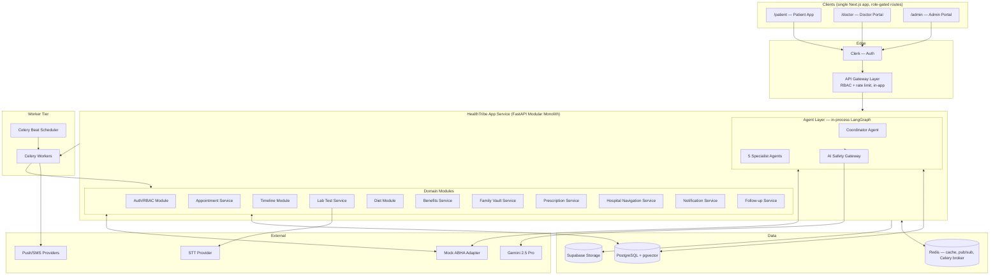

**Why one service, not two:** LangGraph is a Python library; running it in-process removes a network hop, a second deploy target, and cross-service auth from the hackathon build, while keeping `agents/` as its own top-level package means extracting it into a separately-scaled service later is a deployment change, not a rewrite — the same "module now, service later" logic the v1.0 document already applied correctly to the rest of the backend.

---

## 4. Component Diagram

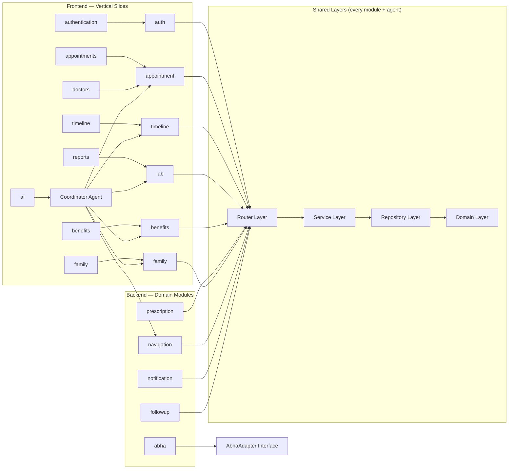

---

## 5. Frontend Architecture

### 5.1 Stack
Next.js 15 (App Router) · React 19 · TypeScript (strict) · Tailwind CSS · shadcn/ui · Framer Motion · TanStack Query · Zustand · React Hook Form · Zod.

### 5.2 Single App, Role-Gated Route Groups (hackathon decision)
One Next.js app with `(patient)`, `(doctor)`, `(admin)` route groups, each with its own layout/shell, gated by `middleware.ts` reading the Clerk role claim. This is a deliberate change from three separate apps: it cuts hackathon setup to one `package.json`, one CI pipeline, one deploy target, while every feature is still built as an isolated vertical slice — so splitting into three apps post-hackathon is a matter of moving folders, not rearchitecting.

### 5.3 Vertical Slice Architecture (unchanged principle from v1.0, kept — it was correct)
Each feature folder owns its UI, hooks, API bindings, schemas, and tests. One feature change touches one folder on the frontend and one module on the backend — a 1:1 mental model.

```
apps/web/src/
├── app/
│   ├── (patient)/               # patient route group + layout
│   ├── (doctor)/                 # doctor route group + layout
│   └── (admin)/                    # admin route group + layout
├── features/
│   ├── authentication/
│   │   ├── ui/  hooks/  components/  schemas/  api/  services/  types/  tests/
│   ├── appointments/    (same shape)
│   ├── timeline/          (same shape)
│   ├── family/              (same shape)
│   ├── reports/               (same shape)
│   ├── doctors/                 (same shape)
│   ├── benefits/                  (same shape)
│   └── ai/                          # chat hero, streaming hook, action cards
├── shared/
│   ├── layout/    # AppShell, BottomTabBar, DoctorShell, AdminShell
│   ├── stores/     # Zustand: session, active dependent
│   └── lib/          # fetch wrapper, error boundary, analytics
└── middleware.ts        # Clerk auth guard + role-based route-group redirect

packages/
├── ui/            # shared shadcn/ui design system
├── api-client/     # TanStack Query hooks generated from OpenAPI
├── types/           # TS types generated from Pydantic models
└── config/             # eslint/tsconfig/tailwind presets
```

### 5.4 Cross-cutting rules
- No feature imports another feature's internals — only `packages/types` or a feature's public `index.ts` export, enforced by `eslint-plugin-boundaries`.
- Server Components by default; Client Components only where interactivity (chat streaming, forms, animation) requires it.
- Zod schemas are the single validation source, reused for both form validation and API-response boundary checks.
- OpenAPI is the contract source of truth (§8) — `packages/types` and `packages/api-client` are generated, never hand-written, and CI fails on drift.

---

## 6. Backend Architecture

### 6.1 Stack
FastAPI · SQLAlchemy 2.0 (async) · Alembic · Celery · Redis · PostgreSQL · pgvector.

### 6.2 Layered Architecture (kept from v1.0 — correct call)
```
Router Layer      → HTTP concerns only (parsing, status codes, OpenAPI schema)
Service Layer      → business logic: consent checks, immutable versioning, rules, event emission
Repository Layer     → one repository per aggregate root, intention-revealing methods
Domain Layer           → framework-free models expressing invariants (no FastAPI/SQLAlchemy deps)
```
Both HTTP routes and Celery tasks call into the same Service Layer, so a rule like "a `TimelineEvent` correction must create a new version, never overwrite" is enforced once, not duplicated per entry point.

### 6.3 Backend Folder Structure

```
backend/
├── app/
│   ├── modules/
│   │   ├── auth/            {router.py, service.py, repository.py, domain.py, schemas.py, tests/}
│   │   ├── appointment/       (same shape)
│   │   ├── timeline/            (same shape)
│   │   ├── lab/                    (same shape)
│   │   ├── diet/                     (same shape)
│   │   ├── benefits/                   (same shape)
│   │   ├── prescription/                 (same shape)
│   │   ├── family/                          (same shape)
│   │   ├── navigation/                        (same shape)
│   │   ├── notification/                        (same shape)
│   │   ├── followup/                               (same shape)
│   │   └── abha/                                     # AbhaAdapter + MockAbhaAdapter
│   ├── agents/                     # in-process LangGraph package (extractable later)
│   │   ├── graph/                    # graph definitions
│   │   ├── nodes/                       # one file per specialist agent (5 files)
│   │   ├── coordinator.py
│   │   ├── safety_gateway/               # §11
│   │   ├── prompts/
│   │   └── state.py
│   ├── shared/
│   │   ├── db/  events/  security/  ocr/  config.py
│   └── main.py
├── workers/           # Celery app + task modules (§15)
├── alembic/               # migrations
└── tests/                    # integration + e2e
```

---

## 7. Database Design

### 7.1 ER Diagram

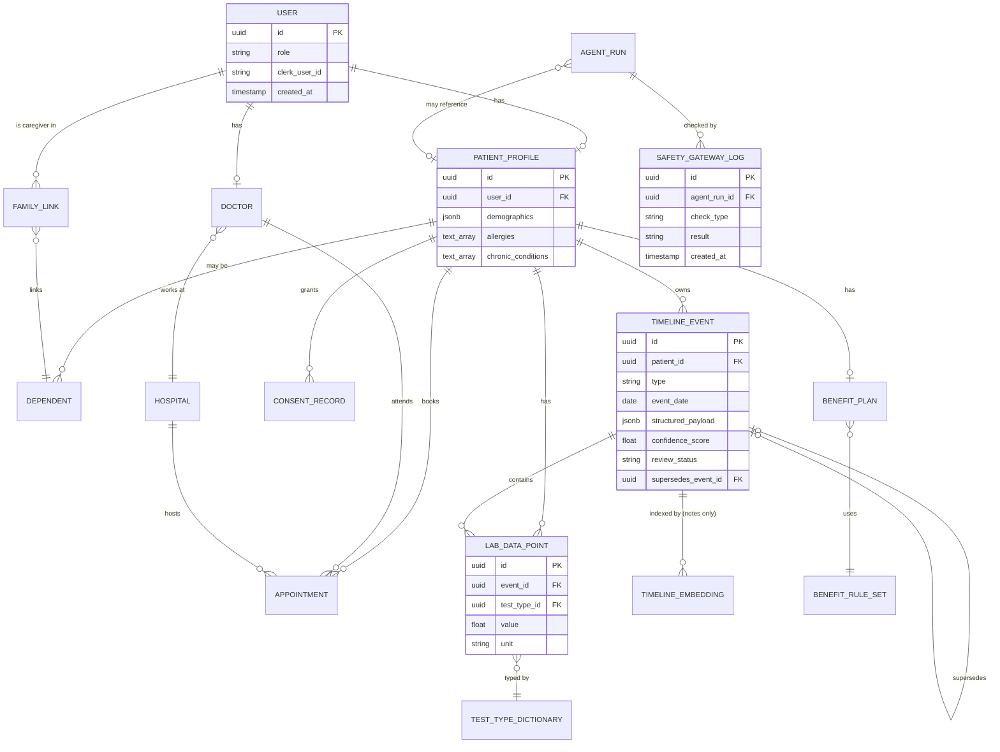

### 7.2 Payload Integrity (new in v2.0)
`TimelineEvent.structured_payload` shape is generated from a single Pydantic discriminated union keyed on `type` (`prescription | lab | scan | consultation_note | discharge_summary`), and enforced at the database level with a `CHECK` constraint validating required keys per type. This closes the gap where a direct DB write (migration, backfill, buggy task) could bypass API-layer Pydantic validation and corrupt an immutable, versioned record.

### 7.3 Indexing
`(patient_id, event_date DESC)` on `TimelineEvent` for the dominant query pattern (patient's chronological history); `(patient_id, test_type_id, recorded_date)` on `LabDataPoint` for trend-series queries; `pgvector` HNSW index restricted to the `TIMELINE_EMBEDDING` table (unstructured note text and the Diet nutrition corpus only — see §12).

---

## 8. API Design

- **OpenAPI-first, mandatory:** every FastAPI router change regenerates `packages/types` and `packages/api-client`; a CI step fails the build if generated output is stale relative to `openapi.json`.
- **Versioned from day one:** all routes under `/api/v1/`.
- **DTOs, never ORM models, at the boundary:** `*Create` / `*Update` / `*Read` Pydantic schemas per resource, preventing accidental field over-exposure (a PII leak vector).
- **Resource shape mirrors modules:** `/api/v1/timeline`, `/api/v1/appointments`, `/api/v1/lab`, `/api/v1/benefits`, `/api/v1/family`, `/api/v1/agents/chat` (the one streaming endpoint, SSE, that fronts the Coordinator).
- **Errors:** RFC 7807 problem-details JSON shape everywhere, so frontend error handling is uniform across all 11 modules.

---

## 9. Authentication

Managed via **Clerk** — session issuance, MFA, social/email login, and JWT verification are Clerk's responsibility, not custom code. This directly replaces v1.0's self-built JWT/refresh-token system (Architecture Review §4.1): the highest-consequence, lowest-differentiation code in the system is no longer something the team writes or debugs under time pressure.

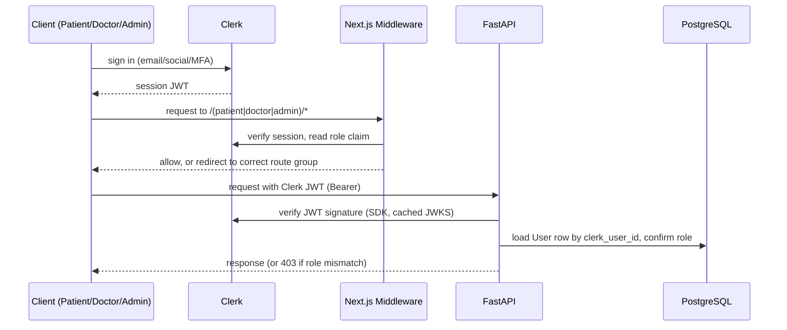

Every FastAPI dependency chain injects `current_user` (verified Clerk identity + DB role) before any Service Layer code runs.

---

## 10. Authorization

**RBAC** with four roles (`patient`, `caregiver`, `doctor`, `admin`) enforced as a FastAPI dependency (`require_role(...)`) at the router layer, plus a second, domain-specific layer for anything patient-data-scoped:

- **`consent_checker`** — a single shared dependency, called by every Service Layer method that reads or writes another person's data (caregiver reading a dependent's timeline, a doctor reading a patient outside their assigned queue). Fail-closed: ambiguous consent scope defaults to denial, never to access.
- **RBAC matrix changes are a reviewed, non-negotiable checkpoint** (carried forward from v1.0 §21.11) — any PR touching the permission matrix or `consent_checker` call sites requires manual security review, not just CI green.

---

## 11. Security

### 11.1 AI Safety Gateway (new, structural — v2.0's central security addition)

Every LLM input and output — across all 6 agents — passes through one shared gateway module, not per-agent prompt instructions.

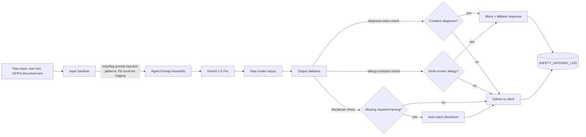

Enforced structurally, in order:
1. **Input side:** any text originating from OCR or free-text patient input is scanned for prompt-injection patterns (instruction-like phrases embedded in document text) before it's interpolated into a prompt; flagged spans are stripped, not passed through.
2. **Output side:** every agent response is checked against a small set of hard rules before leaving the server — no diagnosis-claim language, no omission of a known allergy/critical flag, required "AI-assisted, doctor-reviewed" framing present. Violations block the response (client sees a safe fallback) or get auto-patched (missing disclaimer), never silently pass.
3. **Every check result is logged** to `SAFETY_GATEWAY_LOG`, giving the Admin Portal's Agent Monitoring dashboard a real signal instead of relying on spot-checking transcripts.

### 11.2 Other Security Controls (carried forward from SES §14, unchanged)
Encryption at rest and in transit; audit logs on every PHI read/write; file uploads validated by type/size/content-sniffing before landing in Supabase Storage, served only via short-lived signed URLs, never public; PII fields never appear in application logs (structured logging middleware redacts known PII field names).

---

## 12. Healthcare-Specific RAG

RAG is scoped to exactly two places where semantic similarity search over unstructured text is genuinely useful — **not** applied to structured clinical data, which is retrieved via typed SQL through the Timeline query service (Architecture Review §1.2):

1. **Diet Plan Agent** — retrieves relevant entries from a curated nutrition knowledge base (condition-specific dietary guidance) via pgvector similarity search, grounding generated plans in vetted content rather than model-only knowledge.
2. **Doctor Summary Agent (optional, free-text note search only)** — semantic search across historical consultation-note free text, for the "find similar past complaints" case that a structured filter can't express.

Both use a single embedding model version, tracked in a `EMBEDDING_MODEL_VERSION` config value; a re-embed is a scheduled, versioned migration job (not an ad hoc script) precisely because this is the migration cliff the v1.0 review correctly flagged.

---

## 13. LangGraph Architecture

Runs **in-process** within the FastAPI app (§3) — a Python package under `app/agents/`, not a separate service, for the hackathon window. State persists to Postgres (LangGraph's checkpoint tables) with a retention job (§21) to prevent unbounded growth.

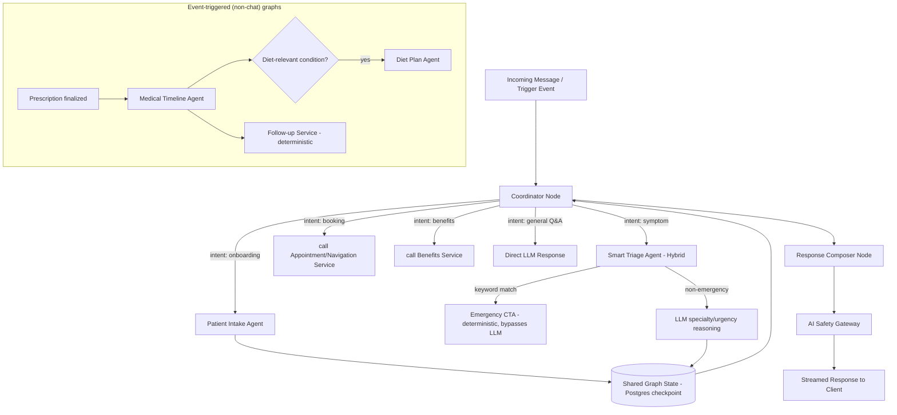

**Node contract (unchanged from SES §10 preamble, applies to all 6 agents):** Purpose, Inputs, Outputs, Tools, Memory, Failure Handling, Guardrails — every agent is a stateless function over persisted state, independently scalable/retryable/replaceable.

---

## 14. OCR Pipeline

Shared module (`app/shared/ocr/`), called by both the Lab Test Service and the Medical Timeline Agent — one pipeline, not a per-agent reimplementation.

1. Upload lands in Supabase Storage; a Celery task (`ocr-processing` queue) picks it up.
2. Document classification (prescription / lab / scan / discharge summary) via a lightweight classifier.
3. Type-specific extraction: structured-field extraction for prescriptions/labs (table/value parsing against the master `TEST_TYPE_DICTIONARY`), metadata-only extraction for scans (image stored as attachment, not parsed for clinical content in MVP).
4. Every extracted field gets a confidence score; anything below threshold is written with `review_status = needs_review` and surfaced to patient/doctor for confirmation before it's trusted in trend calculations — this threshold is a product/clinical judgment call requiring human review before tuning (carried forward from v1.0 §21.11).
5. Extracted free text passes through the AI Safety Gateway's input sanitizer (§11.1) before reaching the Medical Timeline Agent's extraction prompt.

---

## 15. Event-Driven Architecture, Redis Pub/Sub & Celery

### 15.1 Simplified from v1.0 (Architecture Review §2.1)
No formal Event Bus/Kafka layer for the hackathon build. Two mechanisms cover every real need:

- **Redis Pub/Sub** — in-process-adjacent, fire-and-forget notifications between modules within the same request lifecycle (e.g., "invalidate this cache key"), no durability needed.
- **Celery** — anything that must survive a request timeout or run on a schedule: OCR, LLM-bound agent calls triggered by events, notifications, the Recovery Workflow's daily batch.

Queues separated by workload profile: `notifications` (low-latency), `agents` (LLM-bound), `ocr-processing` (CPU-bound), `scheduled` (Celery Beat). A transactional-outbox pattern (write + publish in the same DB transaction) avoids dual-write inconsistency for anything that does need durability later.

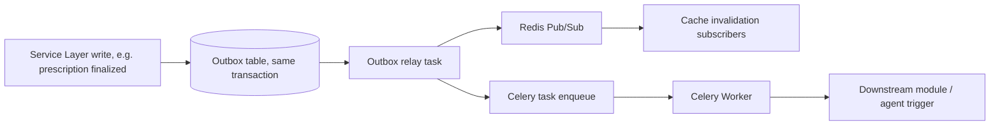

**Revisit trigger for a real Event Bus (Kafka/Streams):** sustained Celery consumer lag > 30s, or event volume > a defined daily threshold — a monitored, automatic ticket, not something someone has to notice informally (fixes the vague "throughput ceiling" language in v1.0).

### 15.2 Caching
Redis for: session-adjacent short-lived data, Doctor Summary output (5 min TTL, invalidated event-driven on new `TimelineEvent` creation for that patient **and** double-checked against `TimelineEvent.created_at` at read time as a belt-and-suspenders guard against a missed invalidation), Celery broker/result backend.

---

## 16. Medical Timeline Engine (Flagship Feature — Deep Detail)

The Timeline is a **normalized event store**, not a document repository. Every other module either writes to it or reads from it.

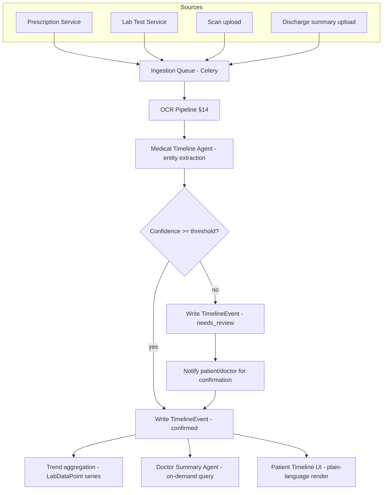

### 16.1 Timeline generation
Ingestion (upload, doctor push, or lab-partner feed) → classification → type-specific extraction (§14) → confidence-scored write. All four source types (prescription, lab, scan, discharge summary) converge on the same `TimelineEvent` shape (§7.2).

### 16.2 Entity extraction
Handled by the Medical Timeline Agent (one of the 6 true AI agents) — drug/dose/frequency from prescriptions, test-name/value/unit/reference-range from labs (normalized against `TEST_TYPE_DICTIONARY` so "HbA1c" and "Hemoglobin A1c" resolve to one trend series), scan metadata. Free text passes the Safety Gateway's input sanitizer first (§11.1, §14).

### 16.3 Versioning
Immutable event history: corrections create a new `TimelineEvent` with `supersedes_event_id` pointing to the original — never an overwrite. Enforced in the Domain Layer constructor (a hard gate every code path must pass through, flagged as a mandatory human-review checkpoint at every PR touching timeline write paths).

### 16.4 Storage
`TimelineEvent` + `LabDataPoint` as described in §7; raw files (scans, source documents) in Supabase Storage as attachments referenced by the event, never parsed for clinical content beyond metadata in MVP.

### 16.5 Timeline APIs
`GET /api/v1/timeline?patient_id=&type=&from=&to=` (chronological, filterable) · `GET /api/v1/timeline/{id}/versions` (full version chain for an event) · `GET /api/v1/timeline/trends/{test_type_id}` (sparkline series) — all under the OpenAPI-first contract (§8).

### 16.6 Doctor summaries
Doctor Summary Agent queries the clinically relevant subset (recent + anything tagged `chronic`/`ongoing`) to respect a 5–10 minute consult window; "full history" expands to the raw chronological view on demand.

### 16.7 Patient timeline
Plain-language default rendering ("Blood sugar check — slightly high" rather than raw lab codes) with a "view full details" expand; filter chips (category, hospital, date range) and free-text search across notes/drug names.

### 16.8 Trend detection
Reference-range breaches flagged at the `LabDataPoint` level (factual, non-alarming) — never inferred narratively by an LLM. This is a deliberate deterministic boundary: trend *flagging* is a rule, trend *explanation* (if surfaced) is the only part an agent touches.

### 16.9 Timeline queries
All structured retrieval goes through the Timeline query service via typed SQL (§1.2 of the Architecture Review) — the only exception is the optional semantic search over free-text notes described in §12.

### 16.10 Timeline UI
Vertical-slice `features/timeline/` on the frontend (§5.3); Framer Motion used for the timeline-sheet expand/collapse transition specifically, not decoratively.

---

## 17. Mock ABHA Adapter Layer

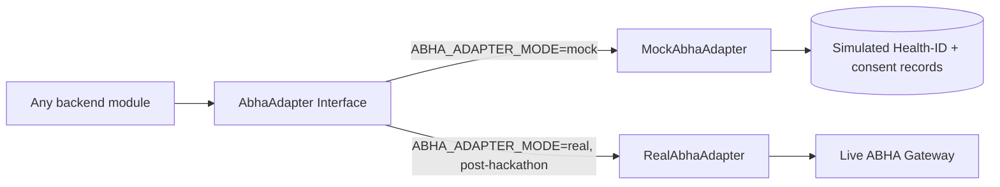

Single interface, two implementations, switched by a feature flag (§20) — not an environment-variable-only switch, so the cutover can be enabled per-environment without a deploy. `MockAbhaAdapter` simulates ID linkage and consent records with realistic shapes so the real adapter is a drop-in swap, not a rewrite of every call site.

---

## 18. Offline Strategy

- **Patient App:** TanStack Query's cache-first strategy serves last-known Timeline/appointment data when offline; a persisted mutation queue (Zustand-backed) retries writes (e.g., a symptom chat message) on reconnect, with clear UI state ("sending when back online") rather than silent failure.
- **Doctor Portal:** no offline support in MVP — clinical actions (prescriptions, summaries) require a live connection by design; a connection-lost banner blocks write actions rather than risking a stale-state prescription write.
- **Service Worker** caches static assets and the last-viewed patient Timeline read-only for the Patient App only.

---

## 19. Monitoring & Observability

- **OpenTelemetry** traces across the request → Service Layer → agent/LLM call path, so a single trace shows both deterministic and AI-agent latency contributions.
- **Sentry** for exceptions across the FastAPI app, Celery workers, and both Next.js apps' build/runtime errors.
- **Grafana + Prometheus** dashboards: p50/p95 latency per module, Celery queue depth per queue (the earliest signal for the Event Bus revisit trigger, §15.1), LLM call volume/cost per agent, Safety Gateway trip rate per check type.
- **Admin Portal Agent Monitoring dashboard** reads directly from `AGENT_RUN` and `SAFETY_GATEWAY_LOG` — the single-orchestrator rule (§2) is what makes this dashboard meaningful rather than a partial view.

---

## 20. AI Cost Optimization & Feature Flags

### 20.1 Cost Optimization
- Agent count reduced from 14 to 6 (§2) is itself the largest cost lever — 8 former "agents" now cost nothing per invocation beyond compute.
- Doctor Summary output cached 5 min per patient (§15.2).
- Healthcare Benefits explanation sentence cached per (patient, benefit-plan-version) pair rather than regenerated per request.
- Single LLM (Gemini 2.5 Pro) across all 6 agents, with prompt-token budgets enforced per agent type and logged per `AGENT_RUN`, so cost-per-agent is visible in the Admin dashboard, not just aggregate spend.

### 20.2 Feature Flags
A `FeatureFlag` service (config table + Redis cache) gates: each of the 6 agents independently (fastest rollback layer — disable a misbehaving agent without a deploy), the `RealAbhaAdapter` cutover (§17), and any Should-Build/Future-Roadmap item (SES §18.2/18.3) so it merges dark and enables per-environment.

---

## 21. Deployment & CI/CD

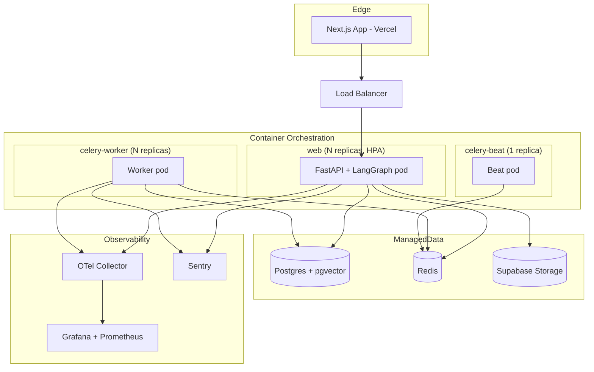

**Two deployables** (web + worker), not four+ — the direct payoff of §3's in-process LangGraph decision. CI: lint (`ruff`, ESLint) → typecheck (`mypy --strict`, `tsc --strict`) → OpenAPI-drift check (§8) → unit tests → integration tests → build → deploy to staging → smoke test → manual promote to prod.

---

## 22. Testing Strategy

- **Unit:** Service Layer methods with mocked repositories (enabled by constructor-injected dependencies, §6.2); Domain Layer invariants (e.g., versioning constructor rejects invalid `supersedes_event_id`) tested in isolation, no DB needed.
- **Deterministic services get full behavioral test coverage** — this is the direct payoff of Issue 1.1's fix: Benefits rules, interaction-checking, navigation ranking are now ordinary pure functions, testable without mocking an LLM.
- **Agent evals:** a labeled eval set per agent (triage classification accuracy, extraction field accuracy, summary factuality against source Timeline data) run nightly in CI; a shadow-evaluation environment runs new prompt versions against anonymized live traffic before promotion.
- **Security tests:** explicit test suite for `consent_checker` call sites (every module that touches cross-user data) and Safety Gateway rule coverage (each guardrail has a positive and negative test case).
- **E2E:** Playwright across the three route groups for the walking-skeleton flow first, then per-feature critical paths.

---

## 23. Sprint Planning

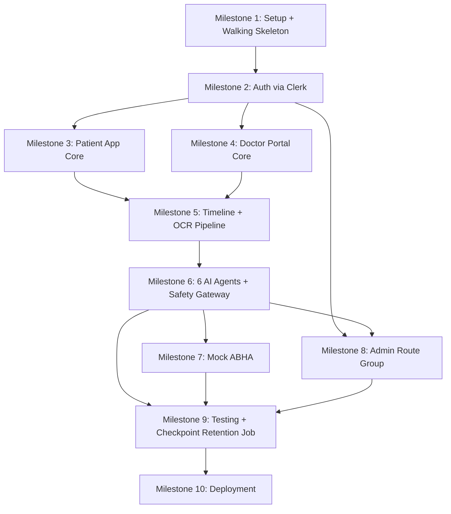

**Implementation order for an AI coding agent working autonomously:**
1. Shared layers (`app/shared/`, `packages/ui`, `packages/types`) before any module.
2. One full vertical slice end-to-end (Clerk auth → one Patient App feature → one backend module) before parallelizing.
3. Timeline module + OCR Pipeline before the AI Layer — every agent depends on Timeline infrastructure existing first.
4. All 10 deterministic backend services before any LLM-dependent agent node — easier to verify correct, de-risks the harder AI work, and gives the Coordinator real services to route to when agent work begins.
5. AI Safety Gateway implemented and tested **before** any agent output can reach a client — hard gate, not an add-later feature.

---

## 24. Antigravity Build Guide

For an AI coding agent building this system autonomously between human checkpoints:

1. **Read `app/shared/` and `packages/types` first** — every module's rules and every DTO shape derive from here; generating module code without reading this first produces drift.
2. **One module = one PR-sized unit.** Each module in `app/modules/` follows the identical five-file shape (§6.3) — generate new modules by pattern-matching an existing completed one (`appointment/` is the reference implementation after Milestone 3), not from scratch.
3. **Never let an agent bypass the Safety Gateway.** Any new agent node must route its output through `app/agents/safety_gateway/` before returning to the Coordinator — this is enforced at code-review time, not just a convention.
4. **Every new endpoint updates the OpenAPI contract** — regenerate `packages/types`/`packages/api-client` as part of the same change, not a follow-up task.
5. **Human checkpoints, not optional:** every Smart Triage prompt, every `consent_checker` call site, the Domain Layer versioning constructor, any RBAC matrix change, and OCR confidence thresholds require explicit human sign-off before merge — flagged in code review templates, not left to agent discretion.
6. **Write an ADR** (`docs/adr/`) for every "Option / Verdict" decision in this document as it's implemented, so the decision history stays queryable as the system grows past what this single document can capture.

---

*End of Technical Design Document v2.0.*
